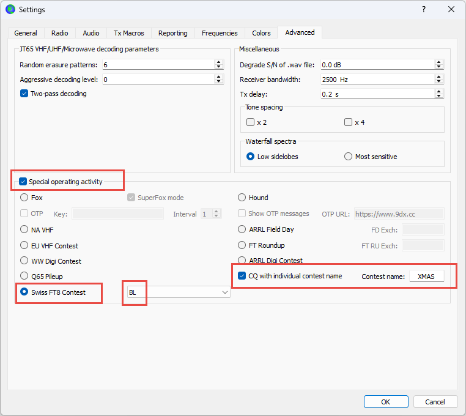
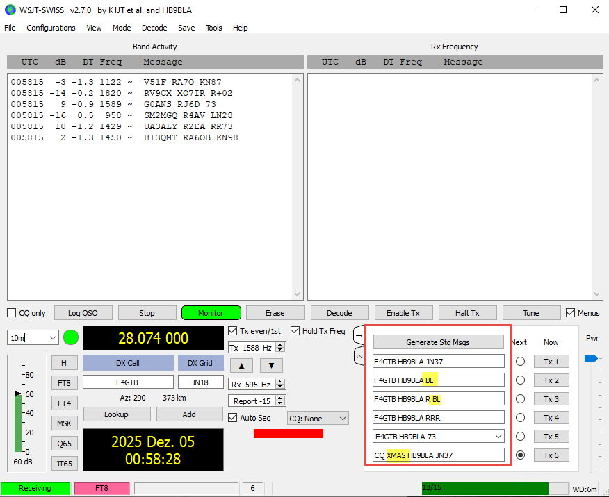

# WSJT-SWISS

[](https://github.com/SensorsIot/wsjtx/actions)
[](https://www.gnu.org/licenses/gpl-3.0)
[](https://github.com/SensorsIot/wsjtx/releases)
[](https://wsjt.sourceforge.io/wsjtx.html)

---

## 1. Purpose of WSJT-SWISS

WSJT-SWISS is a fork of [WSJT-X](https://wsjt.sourceforge.io/wsjtx.html) designed for the **Swiss FT8 Contest**. It enables amateur radio operators to exchange Swiss canton codes as part of the FT8 digital mode protocol.

### Canton Exchange Protocol

WSJT-SWISS uses a custom FT8 message type (i3=0, n3=7) to encode canton information in the 77-bit message structure. During a contest QSO, stations exchange their two-letter canton codes (e.g., ZH for Zürich, BE for Bern) instead of the standard grid locator.

**Example QSO sequence:**

```
Station A (ZH)              Station B (BE)
─────────────────────────────────────────────
CQ ZH HB9AAA JN47
                            HB9AAA HB9BBB -07
HB9BBB HB9AAA -06
                            HB9AAA HB9BBB BE    ← Canton exchange
HB9BBB HB9AAA ZH            ← Canton exchange
                            HB9AAA HB9BBB RR73
```

### ADIF Logging

Swiss contest QSOs are automatically logged with additional ADIF fields:

| Field | Description | Example |
|-------|-------------|---------|
| `MY_CANTON` | Your canton code | `ZH` |
| `HIS_CANTON` | Contacted station's canton | `BE` |

These fields integrate with contest logging software for scoring and verification.

---

## 2. Downloads

Download the latest release from the [Releases page](https://github.com/SensorsIot/wsjtx/releases).

| Package | Description |
|---------|-------------|
| `wsjtx-swiss-installer.zip` | Windows installer (zipped) |

### Download Issues

Your browser or antivirus software may block the download because the file is not commonly downloaded. This is a **false positive** - the software is safe.

**Chrome:** Click "Keep" or go to Downloads and select "Keep dangerous file"

**Edge:** Click "Keep" → "Show more" → "Keep anyway"

**Antivirus:** You may need to add an exception or temporarily disable real-time scanning during download.

---

## 3. Installation

1. Extract `wsjtx-swiss-installer.zip`
2. Run `wsjtx-swiss-installer.exe`

### Microsoft SmartScreen Warning

Windows may show a SmartScreen warning because the application is not signed with a commercial code signing certificate.

**To proceed:**
1. Click **"More info"**
2. Click **"Run anyway"**

This is normal for open-source software distributed outside the Microsoft Store.

### Antivirus Warnings

Some antivirus programs may flag the installer as suspicious. This is a false positive. You can:
- Add an exception for the installer
- Temporarily disable real-time protection during installation
- Verify the download by checking the file hash against the release notes

---

## 4. Setup

1. Launch **WSJT-SWISS** from the Start Menu or installation folder
2. Go to **File** → **Settings** (or press F2)
3. Navigate to the **Advanced** tab
4. Under **Special Operating Activity**, select **Swiss FT8 Contest**
5. Choose your canton from the dropdown menu (default: BL)
6. Click **OK** to save
7. Add XMAS in the "Contest name"
   


Your TX messages will now automatically include your canton code during contest operation and you CQ "XMAS".

---

## 5. Operation

### Starting a QSO

1. Enable **Swiss FT8 Contest** mode (see Setup)
2. Set your frequency to the contest frequency
3. Click **Enable TX** to start calling CQ, or double-click a station to reply
4. The canton exchange happens automatically during the QSO sequence

### Message Flow

| Step | Action |
|------|--------|
| 1 | Station A calls CQ with canton (e.g., "CQ ZH HB9AAA JN47") |
| 2 | Station B responds with signal report |
| 3 | Station A sends signal report |
| 4 | Station B sends canton code |
| 5 | Station A sends canton code |
| 6 | Station B confirms with RR73 |



### Logging

Completed QSOs are logged automatically with:
- Standard FT8 fields (callsign, time, frequency, mode, signal reports)
- Canton fields (`MY_CANTON`, `HIS_CANTON`)

Export your log via **File** → **Export ADIF** for contest submission.

---

## 6. Compatibility

| Scenario | Compatibility |
|----------|---------------|
| WSJT-SWISS ↔ WSJT-SWISS | Full Swiss contest support |
| WSJT-SWISS ↔ WSJT-X | Standard FT8 modes work; canton messages not decoded |
| Standard FT8/FT4/etc. | Fully compatible with all WSJT-X versions |

**Note:** Swiss contest messages (i3=0, n3=7) are only decoded by WSJT-SWISS. Standard WSJT-X will not display these messages.

---

## 7. Building from Source

WSJT-SWISS uses **GitHub Actions** for automated builds. GitHub Actions is a CI/CD (Continuous Integration/Continuous Deployment) service that automatically compiles the software when triggered.

### How to Trigger a Build

**Automatic:** A build starts automatically when a version tag (e.g., `v1.0.2`) is pushed to the repository.

**Manual:**
1. Go to [Actions](https://github.com/SensorsIot/wsjtx/actions)
2. Select **"Build WSJT-X on Windows"**
3. Click **"Run workflow"**
4. Select the branch and click **"Run workflow"**

### Finding Build Artifacts

1. Go to [Actions](https://github.com/SensorsIot/wsjtx/actions)
2. Click on a completed workflow run
3. Scroll to **Artifacts** section
4. Download `wsjtx-swiss-installer` or `wsjtx-swiss-portable`

Artifacts are retained for 30 days.

---

## 8. Credits & License

### Credits

- **WSJT-X** by Joe Taylor, K1JT and the WSJT Development Team
- **Swiss FT8 Contest Mode** fork maintained by [SensorsIot](https://github.com/SensorsIot)

### License

This project is licensed under the **GNU General Public License v3.0** - see the [COPYING](COPYING) file for details.

Based on WSJT-X, Copyright (C) 2001-2023 by Joe Taylor, K1JT.
