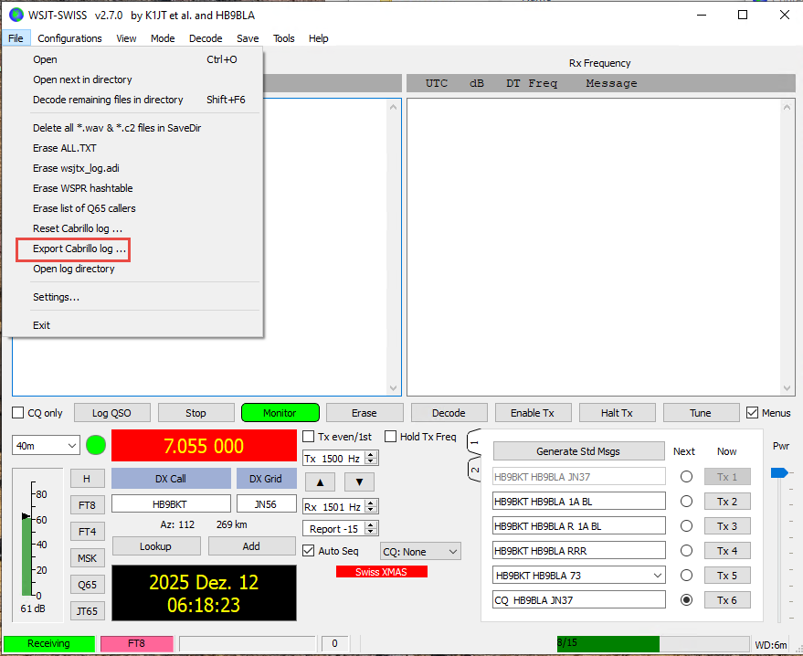

# WSJT-SWISS

[](https://github.com/SensorsIot/wsjtx/actions)
[](https://www.gnu.org/licenses/gpl-3.0)
[](https://github.com/SensorsIot/wsjtx/releases)
[](https://wsjt.sourceforge.io/wsjtx.html)

---

## 1. Zweck von WSJT-SWISS

WSJT-SWISS ist ein Fork von [WSJT-X](https://wsjt.sourceforge.io/wsjtx.html), der für den **Swiss XMAS FT8 Contest** entwickelt wurde. Er ermöglicht es Funkamateuren, Schweizer Kantonskürzel als Bestandteil des FT8-Digitalmode-Protokolls auszutauschen.

### Kantonsaustausch-Protokoll

WSJT-SWISS basiert auf dem ARRL-Fieldday-Protokoll, um Kantonsinformationen in der 77-Bit-Nachrichtenstruktur zu kodieren. Während eines Contest-QSOs tauschen die Stationen ihre zweibuchstabigen Kantonskürzel (z. B. **ZH** für Zürich, **BE** für Bern)  aus.

**Beispielhafter QSO-Ablauf:**

```
Station A (ZH)              Station B (BE)
─────────────────────────────────────────────
CQ ZH HB9AAA JN47
                            HB9AAA HB9BBB -07
HB9BBB HB9AAA -06
                            HB9AAA HB9BBB BE    ← Kantonsaustausch
HB9BBB HB9AAA ZH            ← Kantonsaustausch
                            HB9AAA HB9BBB RR73
```

### ADIF-Logging

Schweizer Contest-QSOs werden automatisch mit zusätzlichen ADIF-Feldern gespeichert:

| Feld | Beschreibung | Beispiel |
|------|--------------|----------|
| `MY_CANTON` | Eigener Kantonscode | `ZH` |
| `HIS_CANTON` | Kantonscode der Gegenstation | `BE` |

Diese Felder können von Contest-Logsoftware für Auswertung und Verifikation genutzt werden.

---

## 2. Downloads

Die neueste Version findest du auf der [Releases-Seite](https://github.com/SensorsIot/wsjtx/releases).

| Paket | Beschreibung |
|------|--------------|
| `wsjtx-swiss-installer` | Windows-Installer (ZIP) |

### Probleme beim Download

Dein Browser oder Antivirusprogramm kann den Download blockieren, weil die Datei nicht häufig heruntergeladen wird. Das ist ein **False Positive** – die Software ist sicher.

**Chrome:** „Behalten“ klicken oder in „Downloads“ „Gefährliche Datei behalten“ auswählen.  
**Edge:** „Behalten“ → „Weitere Informationen“ → „Trotzdem behalten“.  
**Antivirus:** Ggf. Ausnahme hinzufügen oder Echtzeitschutz während des Downloads kurzzeitig deaktivieren.

---

## 3. Installation

1. `wsjtx-swiss-installer.zip` entpacken
2. `wsjtx-swiss-installer.exe` ausführen

### Automatischer Import von Einstellungen

Beim ersten Installieren importiert WSJT-SWISS automatisch deine Einstellungen aus WSJT-X, wenn:

- keine vorhandene WSJT-SWISS-Konfiguration gefunden wird und
- eine WSJT-X-Konfiguration unter `C:\wsjtx\WSJT-X.ini` existiert

Dabei werden Rufzeichen, Locator, Audioeinstellungen und Rig-Konfiguration übernommen. Bestehende WSJT-SWISS-Einstellungen werden **nie überschrieben**.

### Microsoft SmartScreen-Warnung

Windows kann eine SmartScreen-Warnung anzeigen, weil die Anwendung nicht mit einem kommerziellen Code-Signing-Zertifikat signiert ist.

**So gehst du weiter vor:**
1. Auf **„Weitere Informationen“** klicken
2. **„Trotzdem ausführen“** wählen

Das ist bei Open-Source-Software außerhalb des Microsoft Store üblich.

### Antivirus-Warnungen

Einige Antivirusprogramme können den Installer als verdächtig einstufen. Das ist in der Regel ein False Positive. Du kannst:

- eine Ausnahme für den Installer hinzufügen
- den Echtzeitschutz während der Installation kurzzeitig deaktivieren
- den Download über den Dateihash gegen die Release-Notes verifizieren

---

## 4. Start von WSJT-SWISS

Nach der Installation kannst du WSJT-SWISS auf mehrere Arten starten:

- **Startmenü:** Eintrag **WSJT-X**
- **Desktop:** Desktop-Verknüpfung (falls bei der Installation erstellt)
- **Installationsordner:** `C:\WSJT\wsjtx\bin\wsjtx.exe`

---

## 5. Einrichtung

1. **WSJT-SWISS** starten
2. **File** → **Settings** (oder Taste **F2**)
3. Reiter **Advanced** öffnen
4. Unter **Special Operating Activity** → **Swiss XMAS** auswählen
5. Eigenen Kanton aus der Dropdown-Liste auswählen
6. Mit **OK** speichern
7. Im Feld **Contest name** `XMAS` eintragen


Die TX-Nachrichten enthalten nun automatisch deinen Kantonscode, und du rufst CQ als **CQ XMAS**.

---

## 6. Betrieb (wie üblich bei FT8)

### QSO starten

1. **Swiss FT8 Contest**-Modus aktivieren (siehe Einrichtung)
2. Frequenz auf die Contest-Frequenz (**7,055 MHz**) einstellen
3. **Enable TX** klicken, um CQ zu rufen, oder eine Station doppelklicken, um zu antworten
4. Der Kantonsaustausch passiert automatisch im QSO-Ablauf

### Nachrichtenablauf

| Schritt | Aktion |
|--------|--------|
| 1 | Station A ruft CQ mit Kanton (z. B. „CQ ZH HB9AAA JN47“) |
| 2 | Station B antwortet mit Rapport |
| 3 | Station A sendet Rapport |
| 4 | Station B sendet Kantonscode |
| 5 | Station A sendet Kantonscode |
| 6 | Station B bestätigt mit RR73 |


### Logging

Abgeschlossene QSOs werden automatisch gespeichert mit:

- Standard-FT8-Feldern (Rufzeichen, Zeit, Frequenz, Mode, Rapporte)
- Kantonsfeldern (`MY_CANTON`, `HIS_CANTON`)

Wie üblich bei WSJT-X kann man ein Cabrillo Log erzeugen und auf  https://contestlog.uska.ch/submit hochladen



Vor dem Upload müssen die Felder nach dem folgenden Beispiel ausgefüllt werden:


---

## 7. Kompatibilität

| Szenario | Kompatibilität |
|----------|---------------|
| WSJT-SWISS ↔ WSJT-SWISS | Vollständige Swiss-Contest-Unterstützung |
| WSJT-SWISS ↔ WSJT-X | Standard-FT8 funktioniert; Kantonsmeldungen werden nicht dekodiert |
| Standard FT8/FT4/etc. | Voll kompatibel mit allen WSJT-X-Versionen |

**Hinweis:** Swiss-Contest-Nachrichten werden nur von WSJT-SWISS korrekt dekodiert. Standard-WSJT-X zeigt diese Nachrichten nicht an.

