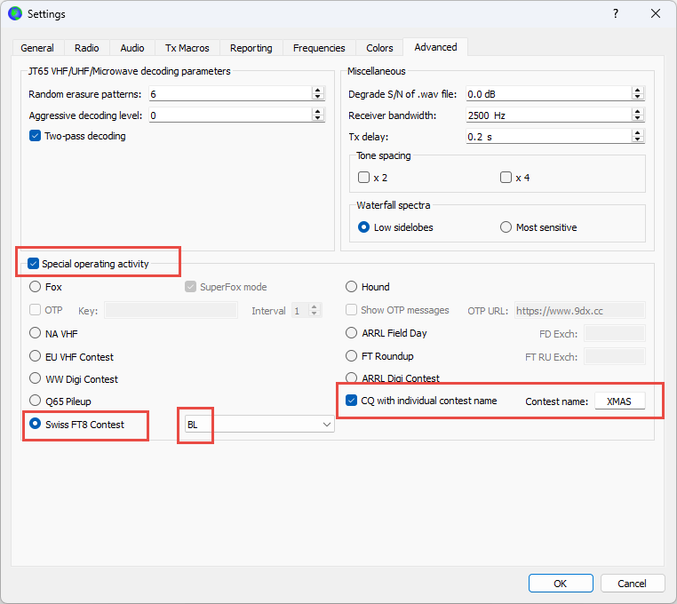
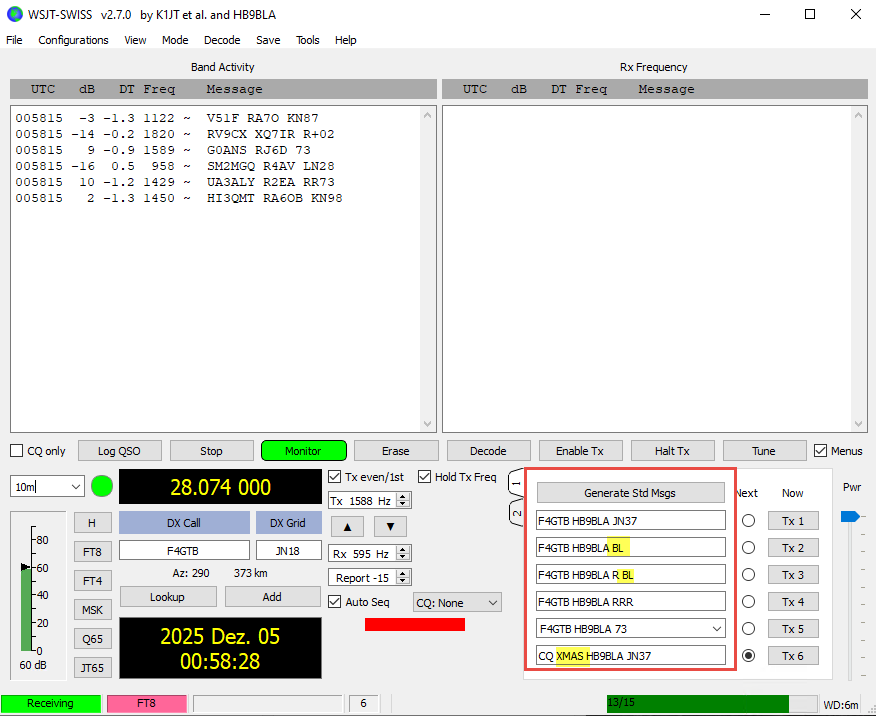
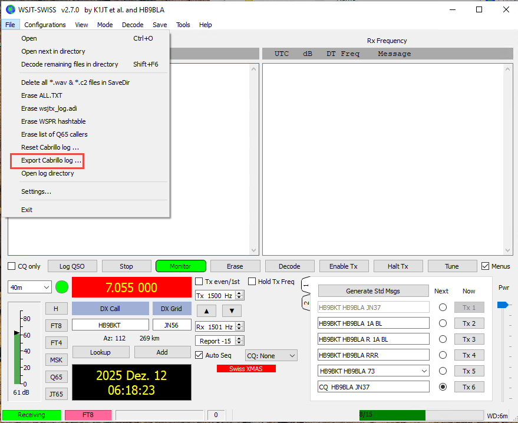
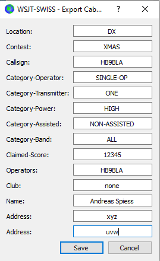

# WSJT-SWISS

[](https://github.com/SensorsIot/wsjtx/actions) [](https://www.gnu.org/licenses/gpl-3.0) [](https://github.com/SensorsIot/wsjtx/releases) [](https://wsjt.sourceforge.io/wsjtx.html)

---

## ***This software is installed independently of your WSJT-X software. It can be removed by simply deleting the C:\WSJTX-SWISS directory. It should import your standard WSJT-X settings***

## */P or /M etc. as well as 4-character callsigns like HB9HSLU do not work*

## 1. Purpose of WSJT-SWISS

WSJT-SWISS is a fork of [WSJT-X](https://wsjt.sourceforge.io/wsjtx.html) developed for the **Swiss XMAS FT8 Contest**. It enables amateur radio operators to exchange Swiss canton codes as part of the FT8 digital mode protocol.

The contest rules can be found here: https://uska.ch/contest/schweizer-contest-kw/

### Canton Exchange Protocol

WSJT-SWISS is based on the ARRL Field Day protocol to encode canton information in the 77-bit message structure. During a contest QSO, stations exchange their two-letter canton codes (e.g., **ZH** for Zurich, **BE** for Bern).

**Example QSO flow:**

```
Station A (ZH)              Station B (BE)
─────────────────────────────────────────────
CQ ZH HB9AAA JN47
                            HB9AAA HB9BBB -07
HB9BBB HB9AAA -06
                            HB9AAA HB9BBB 1A BE    ← Canton exchange
HB9BBB HB9AAA 1A ZH         ← Canton exchange
                            HB9AAA HB9BBB RR73
```

The 1A before the canton can be ignored.

### ADIF Logging

Swiss contest QSOs are automatically saved with additional ADIF fields:

| Field | Description | Example |
|-------|-------------|---------|
| `MY_CANTON` | Own canton code | `ZH` |
| `HIS_CANTON` | Other station's canton code | `BE` |

These fields can be used by contest logging software for evaluation and verification.

---

## 2. Downloads

The latest version can be found on the [Releases page](https://github.com/SensorsIot/wsjtx/releases).

| Package | Description |
|---------|-------------|
| `wsjtx-swiss-installer` | Windows installer (ZIP) |

### Download Issues

Your browser or antivirus software may block the download because the file is not frequently downloaded. This is a **false positive** – the software is safe.

**Chrome:** Click "Keep" or select "Keep dangerous file" in "Downloads".
**Edge:** "Keep" → "More information" → "Keep anyway".
**Antivirus:** Add an exception or temporarily disable real-time protection during download.

---

## 3. Installation

1. Extract `wsjtx-swiss-installer.zip`
2. Run `wsjtx-swiss-installer.exe`

### Automatic Settings Import

On first installation, WSJT-SWISS automatically imports your settings from WSJT-X if:

- no existing WSJT-SWISS configuration is found and
- a WSJT-X configuration exists at `%LOCALAPPDATA%\WSJT-X\WSJT-X.ini`

This imports callsign, locator, audio settings, and rig configuration. Existing WSJT-SWISS settings are **never overwritten**.

### Microsoft SmartScreen Warning

Windows may show a SmartScreen warning because the application is not signed with a commercial code-signing certificate.

**How to proceed:**
1. Click **"More info"**
2. Select **"Run anyway"**

This is common for open-source software outside the Microsoft Store.

### Antivirus Warnings

Some antivirus programs may flag the installer as suspicious. This is usually a false positive. You can:

- add an exception for the installer
- temporarily disable real-time protection during installation
- verify the download against the release notes using the file hash

---

## 4. Starting WSJT-SWISS

After installation, you can start WSJT-SWISS in several ways:

- **Start Menu:** Entry **WSJT-X**
- **Desktop:** Desktop shortcut (if created during installation)
- **Installation folder:** `C:\WSJTX-SWISS\bin\wsjtx.exe`

---

## 5. Setup

1. Start **WSJT-SWISS**
2. **File** → **Settings** (or press **F2**)
3. Open the **Advanced** tab
4. Under **Special Operating Activity** → select **Swiss XMAS**
5. Select your canton from the dropdown list
6. Save with **OK**
7. Enter `XMAS` in the **Contest name** field



The TX messages will now automatically contain your canton code, and you will call CQ as **CQ XMAS**.

---

## 6. Operation (as usual with FT8)

### Starting a QSO

1. Activate **Swiss FT8 Contest** mode (see Setup)
2. Set frequency to the contest frequency (**7.055 MHz**)
3. Click **Enable TX** to call CQ, or double-click a station to reply
4. The canton exchange happens automatically during the QSO flow

### Message Flow

| Step | Action |
|------|--------|
| 1 | Station A calls CQ with canton (e.g., "CQ ZH HB9AAA JN47") |
| 2 | Station B responds with report |
| 3 | Station A sends report |
| 4 | Station B sends canton code |
| 5 | Station A sends canton code |
| 6 | Station B confirms with RR73 |



### Logging

Completed QSOs are automatically saved with:

- Standard FT8 fields (callsign, time, frequency, mode, reports)
- Canton fields (`MY_CANTON`, `HIS_CANTON`)

As usual with WSJT-X, you can generate a Cabrillo log and upload it to https://contestlog.uska.ch/submit



Before uploading, the fields must be filled in according to the following example:



The score is calculated by USKA. Therefore, it can also be filled in with 0.

When uploading, **select Christmas Contest Digital 2 2025** and enter the following category:


---

## 7. Compatibility

| Scenario | Compatibility |
|----------|---------------|
| WSJT-SWISS ↔ WSJT-SWISS | Full Swiss contest support |
| WSJT-SWISS ↔ WSJT-X | Standard FT8 works; canton messages are not decoded |
| Standard FT8/FT4/etc. | Fully compatible with all WSJT-X versions |

**Note:** Swiss contest messages are only correctly decoded by WSJT-SWISS. Standard WSJT-X does not display these messages.
